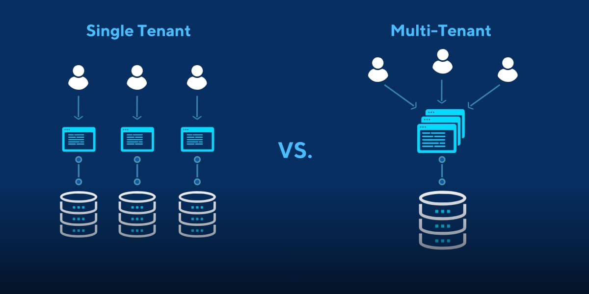

# AcademyAPI

## Overview 🔍

This repository contains the code for a **REST API** designed to **manage students data** for various academies, developed using ASP.NET Core 6. It also includes a comprehensive **CI/CD pipeline** that automates **API deployment on Azure** and integrates **various testing and quality assurance stages, including unit tests, smoke tests, and integration with third-party quality tools** like SonarQube for code quality analysis and WhiteSource for dependency security scanning.

## API 🔗

For obvious reasons, the code doesn't include Azure key vault and DB connection string used to connect with the Azure DataBase.
These connection can be eassily included by modifying _appsettings.json_ and _appsettings.Development.json_ with a valid _kvUri_ and 
_DBConnectionStringName_. To replicate the database, ensure that all fields of the _Alumn_ entity are created.

### Multi-tenancy 🌍

This API was designed based on a multi-tenancy architecture (more information [here](https://medium.com/@aditijain1100/multitenancy-for-dummies-cb4a02b66916)). This allow the same DB to serve various academies or tenants (University of Lisbon, University of Granada, University of Warsaw and Univesity of Paris) while keeping their data isolated. With this schema, the alumns data of each of the tenants is isolated from the alumns data of other tenants. The main advantage of this approach is its cost efficiency for relative small applications.

### Example 📌

Here is an example of the use of the API with Postman. Due to the use of multi-tenancy, tenant id is included in the request header (Universiy of Lisbon).

The API allow the following methods:

## Deployment using Azure Pipeline ⚙️

The repository also include the _azure-pipelines.yml_ file, which defines the API deployment and integrates stages for unit tests, smoke test and third-party quality tools. This pipeline was executed using Azure Devops Pipelines following CI/CD best practices. Please note that all Azure keys, certain directory names, and other sensitive information have been removed. For those who want to use this project, this pipeline can serve as a good starting point for creating your own.

